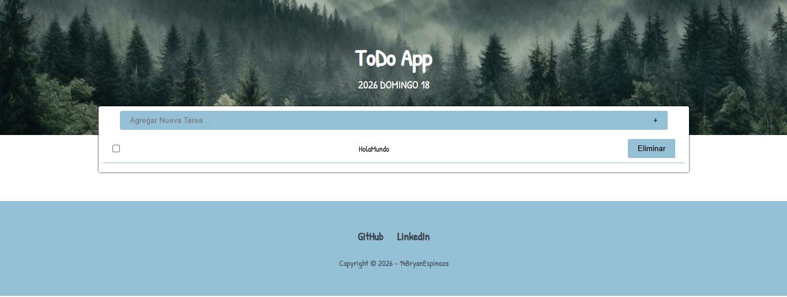

# ToDo App

Aplicación web sencilla para gestionar tareas pendientes (ToDo).  
Permite agregar, marcar como completadas y eliminar tareas, guardándolas en el navegador con **LocalStorage**.  
Proyecto creado para practicar **HTML**, **CSS**, **JavaScript** y el uso de herramientas como **Git**, **GitHub** y **Warp**.

---

## 📸 Captura

---

## 🛠 Tecnologías usadas

- **HTML5**
- **CSS3**
  - Diseño responsivo
  - Flexbox
- **JavaScript (Vanilla)**
  - Manejo del DOM
  - Eventos
  - `localStorage` para persistencia de datos
- **Google Fonts** (`Patrick Hand`)
- Herramientas de desarrollo:
  - **Git**
  - **GitHub**
  - **Warp**

---

## ✨ Funcionalidades

- Mostrar la fecha actual en español en el encabezado.
- Agregar nuevas tareas mediante un formulario:
  - Validación de longitud mínima y máxima del texto.
- Listar todas las tareas en pantalla.
- Marcar tareas como **completadas** o **pendientes**:
  - Estilo visual diferente para tareas completadas.
- Eliminar tareas individualmente.
- Persistencia de tareas usando **LocalStorage**:
  - Las tareas se mantienen al recargar la página.
  - Manejo de errores por si el JSON almacenado se corrompe.

---

## 🔗 Enlace al sitio publicado

- **Sitio publicado**:

> `https://todoapp14bz.netlify.app/`

---

## 📦 Estado del proyecto

- Estado actual: **En desarrollo / mejora continua**.
- Funcionalidades básicas de ToDo: **implementadas**.
- Posibles mejoras futuras:
  - Edición de tareas.
  - Filtros (todas / completadas / pendientes).
  - Contador de tareas.
  - Mejoras de accesibilidad y estilos.
