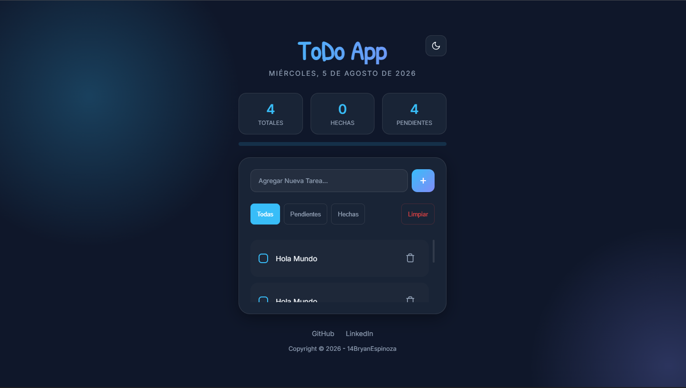

# ToDo App - 14BryanEspinoza

## 🚀 Descripción del Proyecto

Una aplicación de gestión de tareas moderna y elegante con diseño **Glassmorphism**, diseñada para una experiencia de usuario fluida y profesional. Integra:

- **Diseño**: Uso de **Glassmorphism**, gradientes armónicos y tipografía moderna (Google Fonts).
- **Sección de Estadísticas**: Panel interactivo para el seguimiento de tareas totales, hechas y pendientes.
- **Sección de Tareas**: Listado dinámico con filtros (Todas, Pendientes, Hechas) y opción de limpieza masiva.
- **Micro-interacciones**: Transiciones suaves, animaciones de hover y estados activos que mejoran la experiencia de usuario (UX).
- **Optimización Mobile-First**: Layout totalmente responsivo y adaptado para dispositivos táctiles usando unidades modernas (`dvh`).

## 🛠️ Tecnologías y Metodologías

- **HTML5**: Estructura semántica avanzada para SEO y accesibilidad.
- **CSS3 Puro**:
  - **Variables CSS**: Sistema de diseño centralizado para colores, espacios y fuentes.
  - **Flexbox & Grid**: Layouts robustos y modernos sin frameworks externos.
  - **BEM Methodology**: Nomenclatura de clases estricta (`bloque__elemento--modificador`) para un CSS mantenibles.
- **JavaScript (ES6+)**:
  - Manipulación eficiente del DOM y eventos delegados.
  - Generación de identificadores únicos con `crypto.randomUUID()`.
  - Persistencia de datos en tiempo real con **LocalStorage**.
  - Renderizado seguro contra XSS usando `createElement` + `textContent`.
- **Git & GitHub**: Control de versiones, linting automatizado y despliegue continuo vía **GitHub Actions**.
- **Tooling**:
  - **ESLint 9** (flat config) + **Prettier** para calidad y formato consistente.
  - **Husky + lint-staged** con hooks de pre-commit.
  - **pnpm** como gestor de paquetes.

## 📱 Vista Previa

A continuación se muestra una referencia visual del diseño actual:

## 🔗 Enlace al Proyecto

- **Sitio en vivo**: [Ver Proyecto](https://14bryanespinoza.github.io/ToDo-App/)

## 📦 Despliegue (GitHub Pages)

El despliegue se automatiza con **GitHub Actions** (`.github/workflows/deploy.yml`):

- **Trigger**: push a la rama `main`.
- **Job `lint`**: instala dependencias y ejecuta `pnpm lint` (ESLint + Prettier check).
- **Job `deploy`**: publica el sitio en GitHub Pages con permisos mínimos (`contents: read`, `pages: write`, `id-token: write`).
- **Concurrencia**: deploys cancelables para evitar colisiones.

Para activar el deploy:

1. En el repositorio: **Settings → Pages → Source: GitHub Actions**.
2. Hacer merge de `develop` a `main` y pushear.

## 🧪 Calidad y Linting

- `pnpm lint` — ejecuta ESLint (flat config en `eslint.config.js`).
- `pnpm format` — formatea con Prettier.
- Los hooks de **husky + lint-staged** corren ESLint y Prettier en cada commit.

## 📈 Estado y Evolución

El proyecto se encuentra en un estado funcional avanzado, cumpliendo los requisitos de:

- [x] Diseño Responsivo (Mobile, Tablet, Desktop).
- [x] Accesibilidad Web básica.
- [x] Gestión de estado persistente.

**Próximos Pasos**:

- Integración de animaciones de entrada con Scroll Reveal (manteniendo CSS puro).
- Implementación de edición de tareas inline.
- Optimización de activos y soporte para temas dinámicos.

### Desarrollado por Bryan Espinoza - 2026
